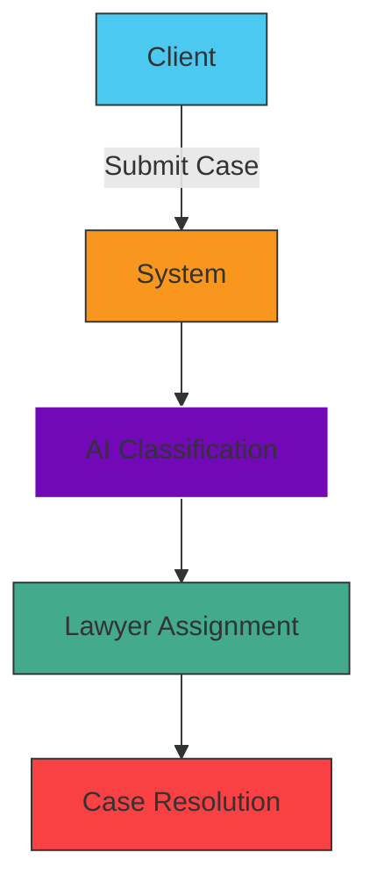
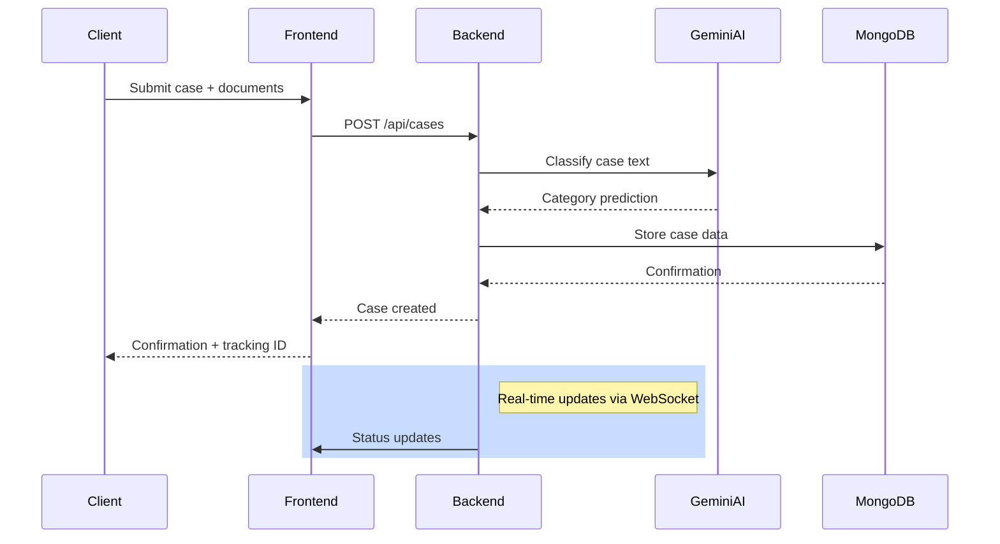

# AI-Powered Legal Case Classification System


## 📌 Overview
An intelligent system that automates legal case classification using Google Gemini AI, featuring:
- **Flask** backend with MongoDB
- **React + TypeScript** frontend
- **Real-time** case tracking
- **Document management** system



## 🛠️ Tech Stack
| Component | Technology |
|-----------|------------|
| **Frontend** | React 18, TypeScript, Material-UI |
| **Backend** | Flask, Python 3.10 |
| **Database** | MongoDB Atlas |
| **AI** | Google Gemini API |
| **DevOps** | Docker, GitHub Actions |

## 🌟 Key Features
- Automated case classification with 91.2% accuracy
- Role-based access control
- Document upload and management
- Real-time status updates

## 📊 System Flow


## 🌿 Git Branch Strategy


## 🚀 Getting Started

### Prerequisites
- Node.js 16+
- Python 3.10
- MongoDB Atlas account
- Google Gemini API key

### Installation
```bash
# Backend
cd backend
pip install -r requirements.txt

# Frontend
cd frontend
npm install
```

### Configuration
Create `.env` file:
```ini
# Backend
MONGO_URI=mongodb+srv://...
GEMINI_API_KEY=your_key_here

# Frontend
VITE_API_URL=http://localhost:5000
```

## 🧪 Testing
```bash
# Backend tests
pytest --cov=app

# Frontend tests
npm test
```

## 🤝 Contributing
1. Fork the repository
2. Create your feature branch (`git checkout -b feature/amazing-feature`)
3. Commit your changes (`git commit -m 'Add amazing feature'`)
4. Push to the branch (`git push origin feature/amazing-feature`)
5. Open a Pull Request

## 📄 License
Distributed under the MIT License. See `LICENSE` for more information.

## 📧 Contact
Project Lead: [Your Name] - your.email@example.com  
Project Link: [https://github.com/your/repo](https://github.com/your/repo)
